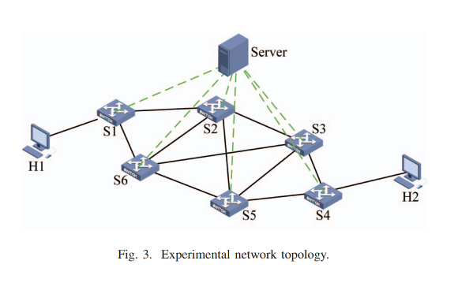
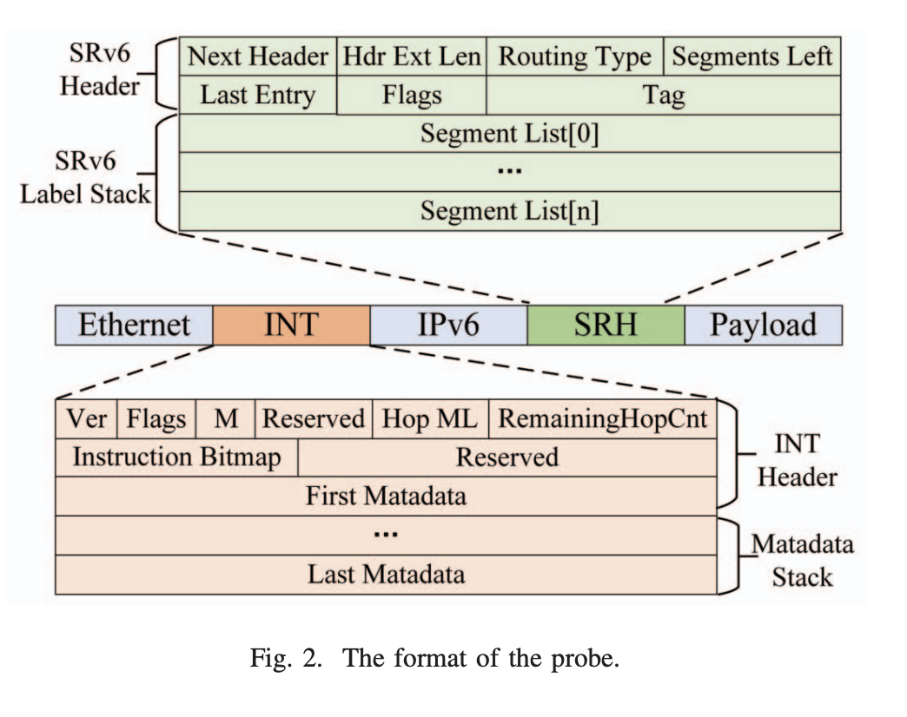
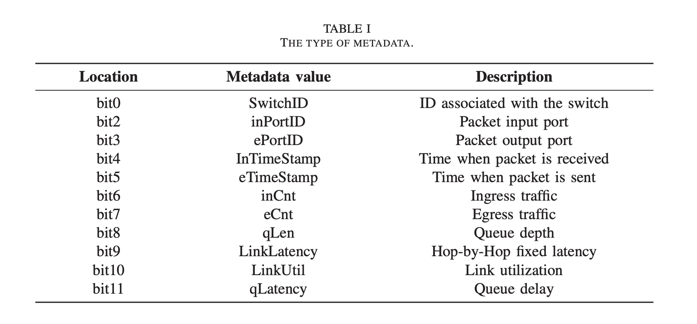

# Implementation plan
_for In-band Network Telemetry_

Team: Máté Fekete, Nóra Szécsi and Róbert Fikó (alphabetical order)

## Open questions
1. Is there more SRH headers, if not, what is next header?
2. Is there one INT header or not? If there is one, all of the switches append their telemetry data to it?
3. What happens if the packet exceeds the MTU, (so M bit is flipped, in INT header)? We wait for the next packet? What kind of headers should/will it have?
4. Hop ML(5 bits) indicates the amount of metadata inserted by
switches, RemainingHopCnt(8 bits) indicates the number of remaining switches that are allowed to add their metadata to the packet. Why is RemainingHopCnt larger then Hop ML? (5 vs 8 bits)
5. What should be the format of this assignment, Markdown is fine? or PDF? or...?
6. How to solve the forwarding of the Probe? Is there any implementation of SRH routing? 

## Goals
- process INT instructions in SRv6 labels
- store the telemetry values in an INT header
- generate test traffic
- SRv6 header processing and routing

## Plan

### 1. Startring project
There are many projects in the lab repository, one will be used as starting off and the topology and tests will be modified as needed. The starting project should contain hosts and switches, but most of them contains.

Basic headers, like Ethernet headers and other things will be used from the start project.

### 2. Desing the topology
As the research paper has examples of a topology of six switches, two hosts and a server, we will use this exact same network topology. 

_Picture source: research paper TODO:_

### 3. Server in the topology
The project requires a server which can receive requests from the Business Application to collect telemetry.
- In this project a really simple Python script will be the "Business Application" which will simulate a real one.
- TODO: how the business application will communiate with the server?

### 4. Path Planning Alogrithm
In the provided research paper, there is Algorthim 2, which describes how to find the path for telemetry path. It needs to be implemented

#### 4.1 Prototype implementation, PoC (Proof of Concept)
In the first iteration of the implementation the switchis will only report back some basic data, like they are alive, or something like that.

### 5. Implementation of Probe
The Probe is the data/packet which is sent out by the server to a switch, with the types of telemetries which needs to be collected and correct pth.

_Picture source: research paper TODO:_

#### 5.1 INT header and Metadata stack
The implementation of the INT header and Metadata stack is required so the network device nows what kind of telemetry is required and other metadata. The structure of the metadata is the following.

_Picture source: research paper TODO:_

### 6. Implementation of the SRH (SRv6) header
TODO: Should contain what telemetry is required from the business application??

#### 6.1 SRv6 header
TODO:

#### 6.2 SRv6 Label stack
TODO:

### 7. Implement the forwarding of the probes in switches
 TODO:

